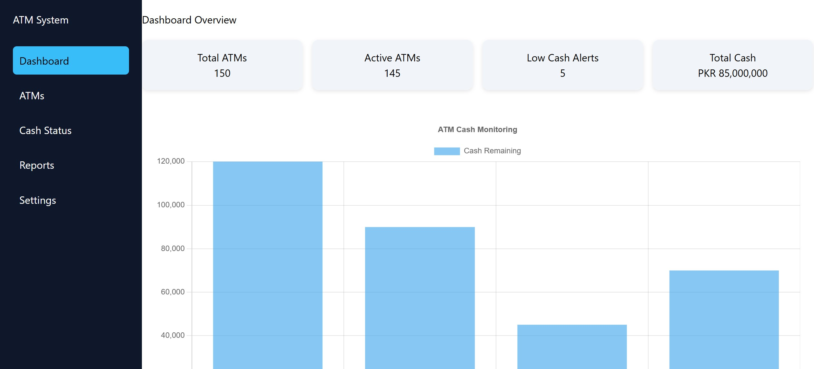
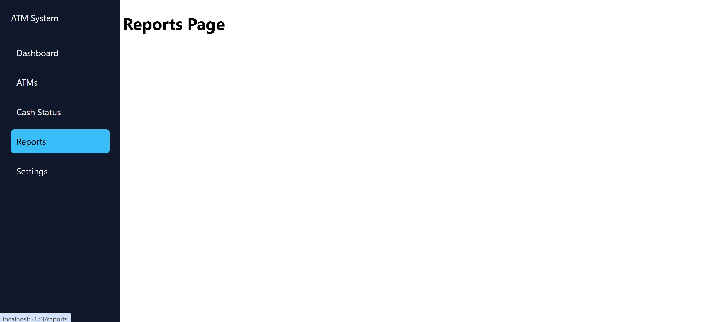
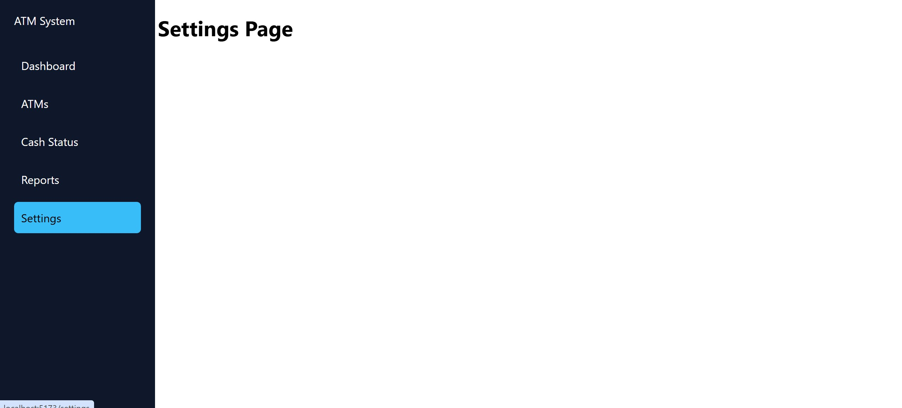

# ATM Cash Monitoring Dashboard

A modern full stack dashboard built using React and Node.js to monitor ATM cash levels and operational status.

---

## Features

- ATM Cash Status Monitoring
- Reports Dashboard
- Settings Module
- REST API Integration
- Responsive Dashboard UI

---

## Tech Stack

### Frontend
- React.js
- Vite
- Chart.js

### Backend
- Node.js
- Express.js

---

## Project Structure

```text
backend/
client/
screenshots/
README.md
```

---

## Dashboard



---

## Reports



---

## Settings



---

## Author

Huraira